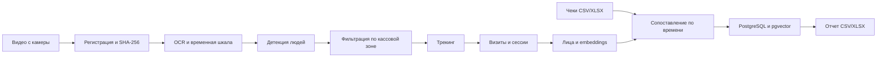

# PechVision

PechVision — локальный pipeline видеоаналитики для кассовой зоны. Система обрабатывает записи с камеры, выделяет посещения, сопоставляет их с чеками и формирует обезличенную аналитическую сводку.

Репозиторий содержит код обработки и структуру базы данных. Исходные видео, чеки, фотографии, обученные модели, рабочие конфигурации и результаты эксплуатации в него не входят.

## Задача и результат

Система создавалась для автоматизации ежедневной аналитики посещений. Вместо ручного просмотра записи она восстанавливает временную шкалу видео, находит посетителей в заданной зоне, объединяет связанные фрагменты в сессии и связывает их с транзакциями.

В текущем рабочем окружении:

- за один запуск обрабатывается около 24 часов, или 25 ГБ, видео;
- среднее время обработки составляет 1,5–2 часа и зависит от числа посетителей;
- с чеками сопоставляется в среднем около 84% найденных за день посещений;
- итоговая сводка ежедневно используется маркетингом и аналитикой.

По данным подразделений заказчика, после внедрения продажи в анализируемом направлении выросли на 11%. Это наблюдаемая бизнес-метрика после запуска системы, а не результат контролируемого эксперимента.

## Как устроена обработка



Основные этапы:

1. Видео регистрируется по метаданным и SHA-256, поэтому переименование файла не создает дубликат.
2. OCR определяет время начала записи по нескольким кадрам и независимо проверяет временную шкалу ближе к концу видео.
3. YOLO обнаруживает людей, после чего учитываются только пересечения с настраиваемым полигоном кассовой зоны.
4. ByteTrack или BoT-SORT связывает обнаружения между кадрами; адаптивный режим реже анализирует пустые участки видео.
5. InsightFace формирует embeddings лиц, объединяет повторные посещения и при необходимости исключает сотрудников из клиентского потока.
6. Фрагменты визитов объединяются в логические сессии, а чеки сопоставляются с ними по временному окну и правилам разрешения неоднозначности.
7. Результаты сохраняются в PostgreSQL и выгружаются в итоговый отчет.

## Технические решения

- **Конфигурация:** YAML и строгая проверка параметров через Pydantic.
- **Хранение:** SQLAlchemy 2, PostgreSQL, JSONB и Alembic-миграции.
- **Поиск похожих лиц:** 512-мерные векторы в pgvector и HNSW-индекс по cosine distance.
- **Повторяемость запуска:** снимок значимых настроек и его хеш сохраняются вместе с обработкой.
- **Защита от повторной записи:** стабильные ключи событий, уникальные ограничения и fingerprint видео.
- **Диагностика:** отдельные CLI-команды для проверки OCR, временной шкалы, зоны, детекции, трекинга и построения визитов.
- **Отчетность:** выгрузка агрегированных данных в XLSX.

Подробное описание таблиц и связей находится в [документации по базе данных](docs/database_schema.md).

## Стек

| Область | Технологии |
|---|---|
| Язык и CLI | Python 3.11, Click |
| Работа с данными | NumPy, pandas, openpyxl |
| Компьютерное зрение | OpenCV, Ultralytics YOLO, InsightFace, PaddleOCR |
| Хранение | PostgreSQL, pgvector, SQLAlchemy 2, Alembic |
| Конфигурация и качество | Pydantic, YAML, Ruff |

## Структура проекта

```text
pechvision/
├── cli/          # команды запуска и диагностики
├── config/       # схема, загрузка и снимки конфигурации
├── db/           # SQLAlchemy-модели и подключение к БД
├── identity/     # сопоставление персон и исключение сотрудников
├── matching/     # привязка чеков к посещениям
├── receipts/     # чтение и импорт чеков
├── reports/      # формирование итоговых отчетов
├── video/        # регистрация видео, OCR и основной pipeline
├── vision/       # детекция, трекинг, лица и кассовая зона
└── visits/       # объединение фрагментов в сессии

alembic/          # миграции PostgreSQL
configs/          # пример конфигурации
data/             # локальные входные данные, модели и результаты
docs/             # техническая документация
```

## Локальный запуск

### Требования

- Python 3.11 или новее;
- PostgreSQL с установленным расширением pgvector;
- локальные веса моделей YOLO и InsightFace;
- системные зависимости используемых библиотек компьютерного зрения.

### Установка

```bash
python -m venv .venv
source .venv/bin/activate
python -m pip install --upgrade pip
pip install -e ".[ml]"
```

Для Windows команда активации окружения:

```powershell
.venv\Scripts\activate
```

Создайте базу PostgreSQL, включите расширение `vector` и укажите одинаковую строку подключения в `configs/default.yaml` и `alembic.ini`. Не сохраняйте рабочий пароль в публичном репозитории.

```sql
CREATE EXTENSION IF NOT EXISTS vector;
```

Примените миграции и проверьте конфигурацию:

```bash
alembic upgrade head
pechvision config-check configs/default.yaml
pechvision db-check configs/default.yaml
```

Положите тестовое видео, файл чеков и модели в каталоги, заданные секцией `paths` конфигурации. В примере используются:

```text
data/input/videos/
data/input/orders/
data/models/
data/output/reports/
```

Файл чеков должен содержать колонки времени открытия и закрытия, идентификатора и суммы. Их названия задаются в секции `receipts`; пример конфигурации ожидает `openTime`, `dl_tm`, `OrderId` и `OrderSum`.

### Основной сценарий

```bash
# импорт транзакций
pechvision import-receipts configs/default.yaml data/input/orders/example.xlsx

# обработка видео
pechvision run-mvp configs/default.yaml data/input/videos/example.mp4

# сопоставление посещений с чеками
pechvision match-receipts configs/default.yaml

# формирование отчета
pechvision export-report configs/default.yaml
```

Для быстрой проверки на небольшом фрагменте используйте параметры `--start-frame` и `--limit`:

```bash
pechvision run-mvp configs/default.yaml data/input/videos/example.mp4 --limit 500
```

Полный список команд доступен через:

```bash
pechvision --help
```

## Работа с данными

Проект обрабатывает видео, чеки и биометрические признаки. Для реального использования необходимы законное основание обработки, ограничение доступа, политика хранения и удаления данных, а также отдельная проверка настроек под конкретную площадку.

`.gitignore` исключает входные видео, чеки, изображения лиц, модели и сформированные отчеты. Перед публикацией форка или примеров следует дополнительно проверить текущие файлы и историю Git на персональные данные и секреты.
